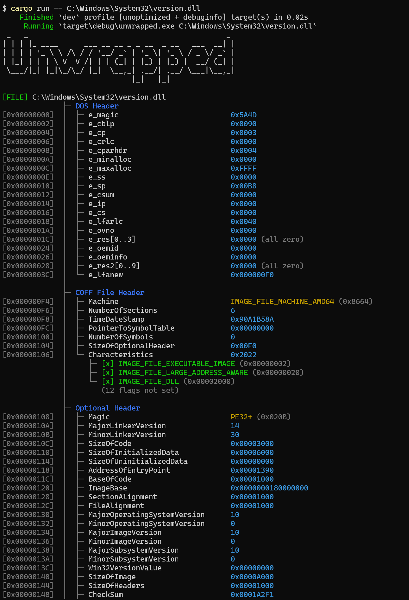

# Unwrapped

PE ファイル（`.exe` / `.dll`）の構造をターミナルにダンプするツール。
`dumpbin` / `readelf` の簡易自作版。

名前の由来: `unwrap`（開梱 + Rust 要素）+ `pe`（PE 要素）+ `d`（Dump 要素）

## ビルド

```
cargo build --release
```

## 使い方

```
unwrapped [--all-flags] <file>
```

| オプション | 説明 |
|------------|------|
| `--all-flags` | Characteristics / DllCharacteristics の未セットフラグも展開表示する |

## デモ


